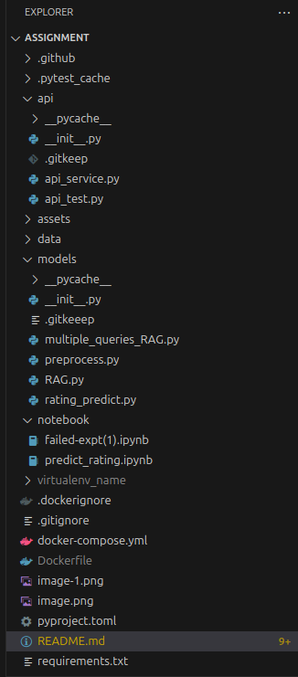
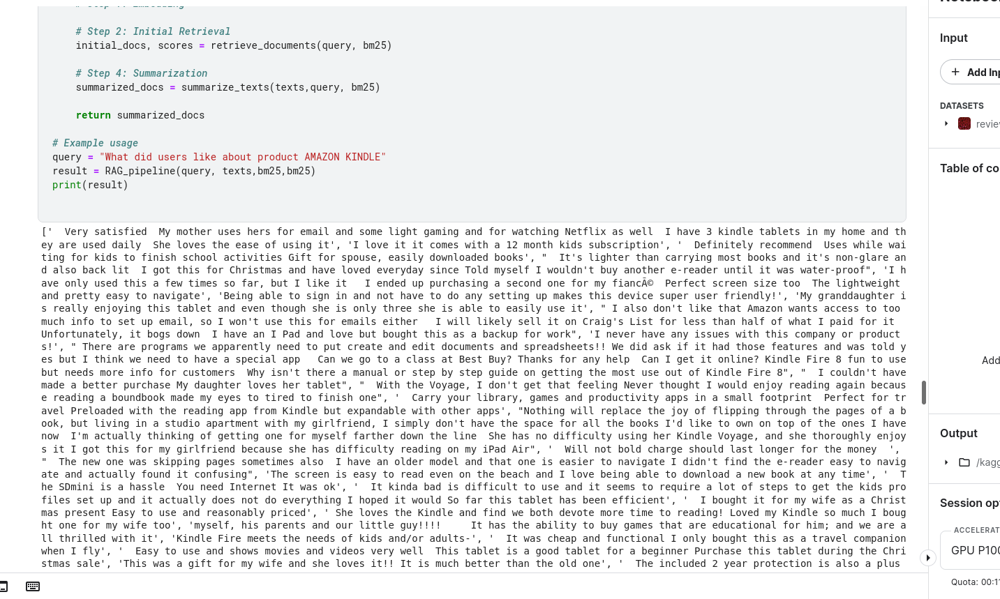

## Assesment


## Installation and Running

```bash
python -m venv venv
source venv/bin/activate
pip install -r requirements.txt
python3 api/api_service.py
python3 api/api_test.py
python3 models/preprocess.py
python3 models/RAG.py
python3 models/rating_predict.py
```

Running the docker image

```bash
sudo docker build .

```

## FOLDER STRUCTURE



- Models used Descion Tree Regrssor ,Random Forest Regrssor,Logistic Regression
- Tranformers- bert-uncased,AutoToeinzer and Auto Model

- Data Requirements: Transformers often require large amounts of data for effective training. Smaller datasets can lead to overfitting or suboptimal performance.Fixed Sequence Length: Transformers rely on fixed-size input sequences due to their positional embeddings. Handling variable-length inputs efficiently can be a challenge.Lack of Causality in Standard Attention: The standard self-attention mechanism used in Transformers doesn’t inherently capture causality. 




**Highest accuracy achieved on test data 81.25%*

Since this is an small experiment hence semantic caching in RAG is  not required.


## FURTHUR ANALYSIS RAG PIPELINE

- Research has shown that the increased generation time
in RAG can be alleviated by reducing the model’s input through
context compression.

- Pre-training Context Embedding
- For the downstream RAG application, we fine-tune the model on a
-question 𝑞, relevant context(s) retrieved by a retrieval system and
compressed into context embeddings E, which are combined into an
instruction 𝐼𝑞,


**In case Romanized Representation of data  like "Ye batti kam nahi karti hae" we need**


- High fertility or Data loss in case of under represented vocab
- poor represenattion quality
- Vocab extension  requires a lot of pretaining
-  Natural Transliteration
-  Fixed Romanized Schemes
 - In Research till now it has been found out that Romanized representations are better alligned to English than native script representations
  
  ** Dealing with multilingual data**

  - Would have used Cohere multilingual embeddings and Anthropic Claude 3  to deal with multilingual data
  - If received a 100 K untagged data ,used the untagged data to pre-train a transformer-based model.
  - Fine-tune the pre-trained model on the small tagged dataset.
  - Pedict labels for the untagged data using the fine-tuned model.
  - Fine-tune the model further using these pseudo-labeled data.
  - Continuously evaluate the model's performance on a validation set.


For setting up the RAG pipeline I have used all the techniques used in the paper https://arxiv.org/abs/2407.01219 according to my specified data


