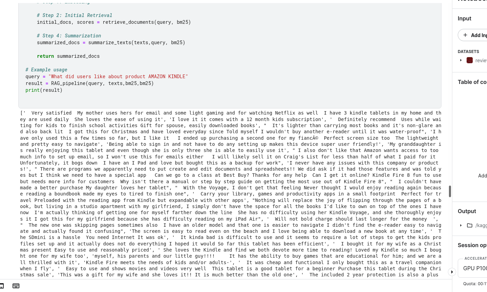
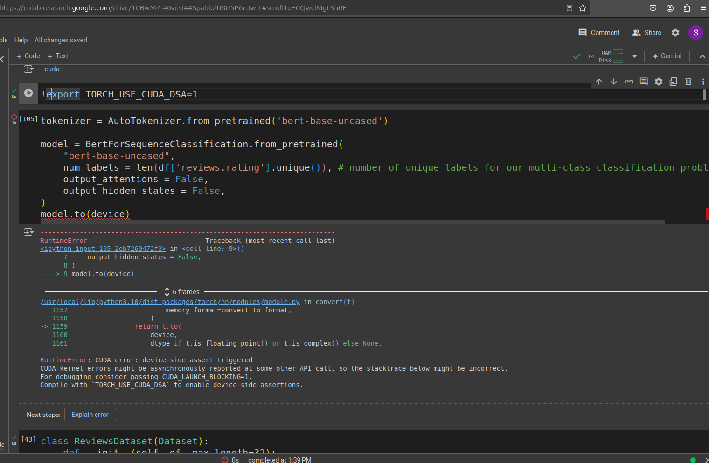

## Assesment


## Installation and Running

```bash
python -m venv venv
source venv/bin/activate
pip install -r requirements.txt
python3 api/api_service.py
python3 api/api_test.py
python3 models/preprocess.py
python3 models/RAG.py
python3 models/rating_predict.py
```

Running the docker image

```bash
sudo docker build .

```
Models used Descion Tree Regrssor ,Random Forest Regrssor
Tranformers- bert-uncased,AutoToeinzer and Auto Model
Data Requirements: Transformers often require large amounts of data for effective training. Smaller datasets can lead to overfitting or suboptimal performance.Fixed Sequence Length: Transformers rely on fixed-size input sequences due to their positional embeddings. Handling variable-length inputs efficiently can be a challenge.Lack of Causality in Standard Attention: The standard self-attention mechanism used in Transformers doesn’t inherently capture causality. 



failed expt 



Since this is an small experiment hence semantic caching in RAG is  not required.

Dont have the access to the api keys of the  claude ,open ai thats why could not use them

## what would I have done if given more time 

- Try to resolve this issue adnd deploy the application in some microservices.
- usage of external data and train on document level data, finetuning on long coherent sequences  helps model to learn and correlate to different piece of knowledge
- Dont have the access to the api keys of the  claude ,open ai thats why could not use them
- Try  with resolve the cuda issue here and achieve a better accuracy

## FURTHUR ANALYSIS RAG PIPELINE

- Research has shown that the increased generation time
in RAG can be alleviated by reducing the model’s input through
context compression.

- Pre-training Context Embedding
- For the downstream RAG application, we fine-tune the model on a
-question 𝑞, relevant context(s) retrieved by a retrieval system and
compressed into context embeddings E, which are combined into an
instruction 𝐼𝑞,


## RAG PIPELINE

- Challenges afced- the the vocabulary of the under represented Indian language
Fertility=Avrage nno of tokens per word
Gigh fertility =More memory consumption and More decoding time
Limit on the longeest processable sequence
Romanized Representation
High fertility or Data loss in case of under represented vocab
poor represenattion quality
Voacb extension  requires a lot of pretaining

In case Romanized Representation of data  like "Ye batti kam nahi karti hae" we need

-  Natural Transliteration
-  Fixed Romanized Schemes
 - In Research till now it has been found out that Romanized representations are better alligned to English than native script representations

